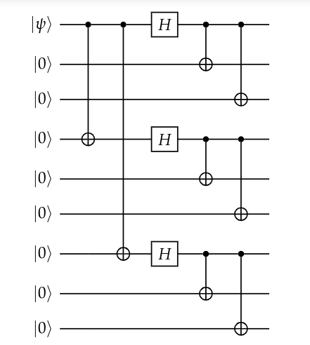
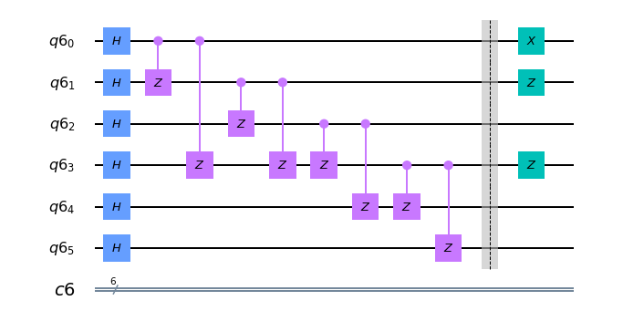

# circuit_diagram
This is an interactive notebook with exercises covering quantum circuit diagrams.

---

## Quantum Gates

In the [Linear Algebra for Quantum Computing](https://the-singularity-research.github.io/linear_algebra_for_quantum_computing/) lectures, there was a lecture on quantum gates. Quantum gates are similar in spirit to classical logic gates used in classical computing. Quantum gates however are always represented by matrices. In particular they are represented by unitary matrices in the quantum circuit model of quantum computing. Quantum circuits are diagrams that represent algorithms which are composed of these quantum gates. 

## Quantum Circuit Diagrams

Quantum circuit diagrams are a visual, graphical representation of quantum algorithms. The usual graphical notation is called *staff notation* and looks very much like the musical staff that composers and musicians write music on. 

## The Notebook

[Quantum Circuit Diagrams Interactive Notebook](https://mybinder.org/v2/gh/The-Singularity-Research/circuit_diagram/1e25770390413e5c2a7d02f598c502a20a3b0dd3?filepath=circuit_diagrams.ipynb)

---

## Interested in contributing to this project? 
- Reach out via email to: thesingularity.research@gmail.com
- Be sure to include "Hacking the Universe" in the subject line, so that the email doesn't get overlooked. 
- Write a paragraph or two about how you would like to contribute.
- Ask to Join the Discord server. 
- Ask to Join the Slack Channel.

This is course material for a course on linear algebra and mathematical prerequisites for quantum computing. It contains Jupyter notebooks that can be downloaded as part of the course or opened in Binder as an online interactive notebook. 

[Become a Sponsor of The Singularity](https://github.com/sponsors/The-Singularity-Research)
